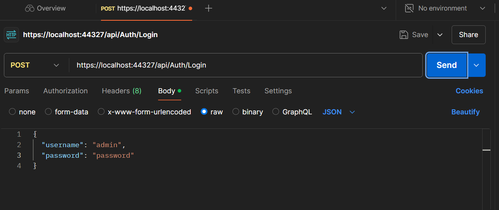
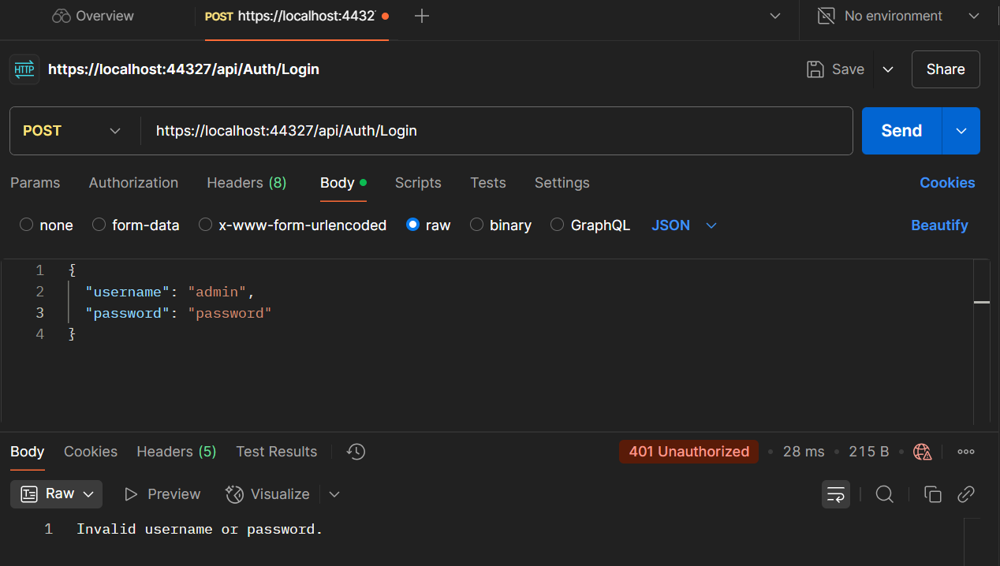
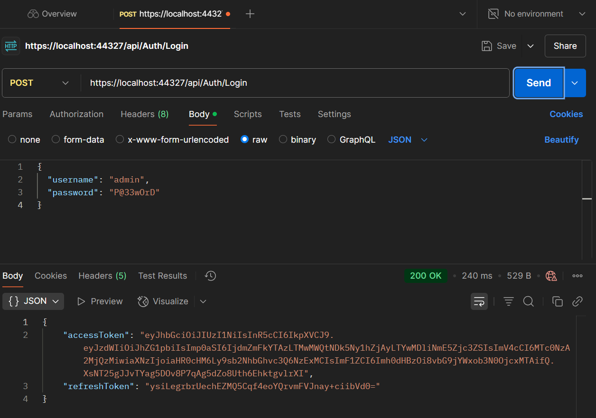
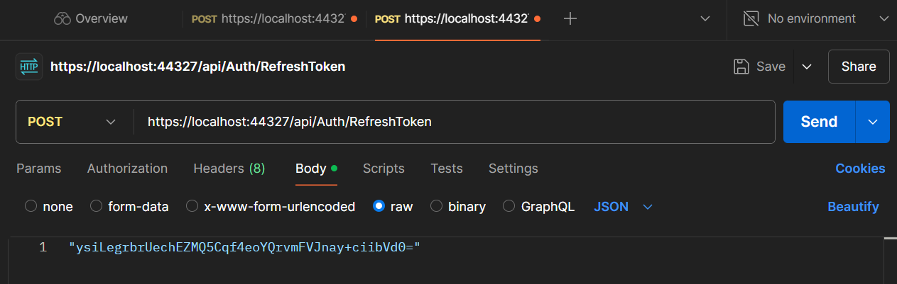
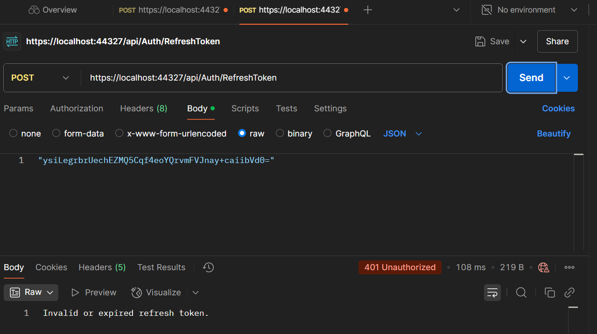
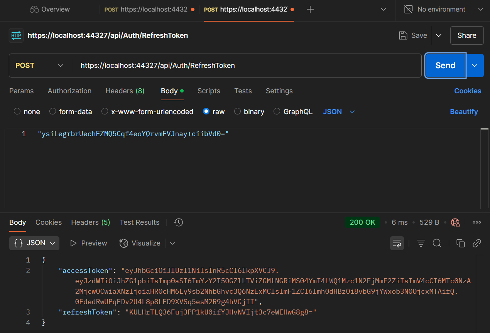
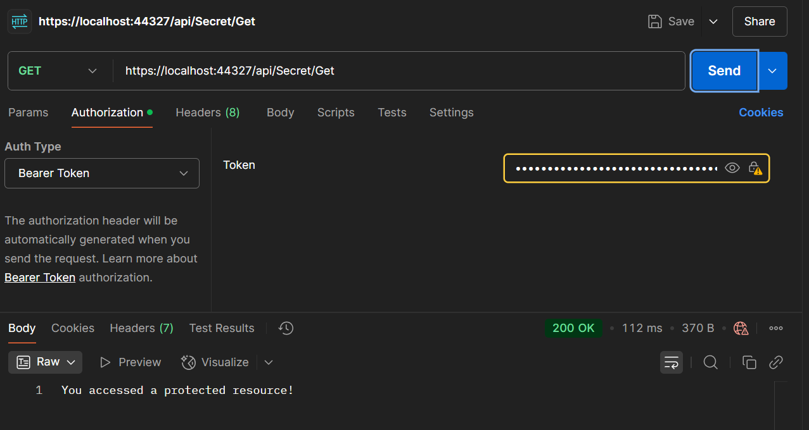

# JwtAuthenticationWithRefreshToken

- Here, we created a controller class `AuthController` that handles authentication and token generation.

## Modifying appsettings.json
- Modified the `AdminCredentials` object to the below in the `appsettings.json` file:
```json
"AuthRequest": {
"Username": <admin>,
"Password": <password>
}
```

- Modified the `"Password"` value.

## Verifying Classes in Models Folder
- Verified the existenceof the below classes in our `Models` folder:

```C#
public class JwtSettings
{
    public string Key { get; set; }
    public string Issuer { get; set; }
    public string Audience { get; set; }
    public int AccessTokenExpirationMinutes { get; set; }
    public int RefreshTokenExpirationDays { get; set; }
}

public class AuthRequest
{
    public string Username { get; set; }
    public string Password { get; set; }
}
```

## Registering Services in Program.cs
- Registered Services in the `Program.cs` file:
```C#
builder.Services.Configure<JwtSettings>(builder.Configuration.GetSection("JwtSettings"));
builder.Services.Configure<AuthRequest>(builder.Configuration.GetSection("AuthRequest"));

builder.Services.AddSingleton<JwtService>();
builder.Services.AddSingleton<IJwtService, JwtService>(); // Use interface if applicable

builder.Services.AddAuthentication("Bearer")
    .AddJwtBearer("Bearer", options =>
    {
        var jwtSettings = builder.Configuration.GetSection("JwtSettings").Get<JwtSettings>();
        options.TokenValidationParameters = new TokenValidationParameters
        {
            ValidateIssuer = true,
            ValidateAudience = true,
            ValidateLifetime = true,
            ValidateIssuerSigningKey = true,
            ValidIssuer = jwtSettings.Issuer,
            ValidAudience = jwtSettings.Audience,
            IssuerSigningKey = new SymmetricSecurityKey(Encoding.UTF8.GetBytes(jwtSettings.Key))
        };
    });

builder.Services.AddAuthorization();
```

## Creating the AuthController class
- Created an `AuthController` class in the `Controllers` folder:
```C#
[Route("api/[controller]/[action]")]
[ApiController]
public class AuthController : ControllerBase
{
    private readonly AuthRequest _authRequest;
    private readonly IJwtService _jwtService;

    public AuthController(IOptions<AuthRequest> options, IJwtService jwtService)
    {
        _authRequest = options.Value;
        _jwtService = jwtService;
    }

    [HttpPost]
    public IActionResult Login([FromBody] AuthRequest authRequest)
    {
        if (authRequest.Username == _authRequest.Username &&
            authRequest.Password == _authRequest.Password)
        {
            var accessToken = _jwtService.GenerateAccessToken(authRequest.Username);
            var refreshToken = _jwtService.GenerateRefreshToken(authRequest.Username);
            return Ok(new { AccessToken = accessToken, RefreshToken = refreshToken });
        }

        return Unauthorized("Invalid username or password.");
    }

    [HttpPost]
    public IActionResult RefreshToken([FromBody] string refreshToken)
    {
        if (_jwtService.ValidateRefreshToken(refreshToken, out var username))
        {
            var newAccessToken = _jwtService.GenerateAccessToken(username);
            var newRefreshToken = _jwtService.GenerateRefreshToken(username);
            return Ok(new { AccessToken = newAccessToken, RefreshToken = newRefreshToken });
        }

        return Unauthorized("Invalid or expired refresh token.");
    }
}
```

- Added a protected endpoint to the `AuthController` class:
```C#
[ApiController]
[Route("api/[controller]/[action]")]
public class SecretController : ControllerBase
{
    [HttpGet]
    [Authorize]
    public IActionResult Get()
        => Ok("You accessed a protected resource!");
}
```

## Testing the endpoints in Postman
1. Testing the Login endpoint
- Open Postman and create a new request.
- Set the request type to POST and enter the URL for the Login endpoint (e.g., https://localhost:{port}/api/Auth/Login).
- Follow the below screenshot:


- Enter the appropriate username and password.
- Incorrect details will throw a `401 Unauthorized` error as seen below:


- Correct details will give a `200 OK` response as seen below:

- You should get both AccessToken and RefreshToken.  


2. Testing the RefreshToken endpoint
- Create a new request.
- Set the request type to POST and enter the URL for the RefreshToken endpoint (e.g., https://localhost:{port}/api/Auth/RefreshToken).
- Follow the below screenshot. Ensure to enter the existing refresh token:

- Incorrect details will throw a `401 Unauthorized` error as seen below:

- Correct details will give a `200 OK` response as seen below:


3. Testing the Secret endpoint
- Create a new request.
- Set the request type to GET and enter the URL for the Secret endpoint (e.g., https://localhost:{port}/api/Secret/Get).
- Follow the below screenshot:

- An incorrect configuration and/or details will give an error.

## Modifying Program.cs to enable authorization in Swagger UI
- Add the below code in the `Program.cs` file:
```C#
builder.Services.AddSwaggerGen(c =>
{
    c.AddSecurityDefinition("Bearer", new OpenApiSecurityScheme
    {
        Description = "Enter 'Bearer' [space] and then your valid access token.\n\nExample: Bearer eyJhbGciOiJIUzI1NiIs...'",
        Name = "Authorization",
        In = ParameterLocation.Header,
        Type = SecuritySchemeType.ApiKey,
        Scheme = "Bearer"
    });

    c.AddSecurityRequirement(new OpenApiSecurityRequirement{
        {
            new OpenApiSecurityScheme{
                Reference = new OpenApiReference{
                    Type=ReferenceType.SecurityScheme,
                    Id="Bearer"
                }
            },
            new string[]{}
        }
    });
});
```